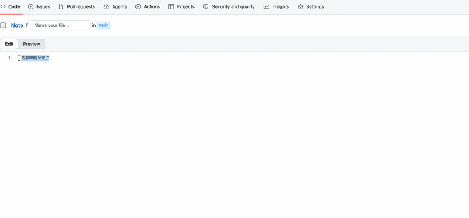

# TextRewriter

A macOS menu bar app that rewrites selected text using AI (Claude, OpenAI, or Gemini).

</img>

## Features

- Select any text in any app → a floating **"Help me rewrite"** button appears near your cursor
- AI rewrites the text with grammar, spelling, and phrasing fixes — streamed character by character
- **Replace** — replaces the original selected text in-place
- **Copy** — copies the result to clipboard and closes
- **Regenerate** — generates a new variation
- **Adjust** — expand a panel to fine-tune the rewrite with:
  - **Tone**: Professional · Casual · Enthusiastic · Informational · Funny
  - **Format**: Paragraph · Email · Bullet points · Blog post
  - **Length**: Short · Medium · Long
- Set a **default tone** in Settings — applied automatically on every rewrite
- **Hotkey mode** — assign a keyboard shortcut (e.g. ⌘⌥R); button won't auto-appear, press the hotkey to open the rewrite panel directly
- API keys stored securely in **macOS Keychain**
- Runs as a background app (menu bar only, no Dock icon)

## Installation

### Download (recommended)

1. Go to [Releases](../../releases) and download the latest `TextRewriter-x.x.x.zip`
2. Unzip and move `TextRewriter.app` to your `/Applications` folder

### First launch (bypass Gatekeeper)

Because the app is not notarized by Apple, macOS will block it on the first open:

1. **Right-click** `TextRewriter.app` → **Open**
2. Click **Open** in the dialog that appears
3. The app will launch and show a sparkles icon (✦) in your menu bar

> After the first launch you can open it normally by double-clicking.

### Grant Accessibility permission

TextRewriter needs Accessibility access to detect selected text across apps:

1. Open **System Settings → Privacy & Security → Accessibility**
2. Enable **TextRewriter**

### Configure your API key

1. Click the ✦ icon in the menu bar → **Settings**
2. Choose your **AI Provider** (Anthropic Claude, OpenAI, or Google Gemini)
3. Enter your API key for the selected provider
4. Optionally set a **Default Tone** to apply on every rewrite

| Provider | Where to get a key |
|---|---|
| Anthropic Claude | [console.anthropic.com](https://console.anthropic.com) |
| OpenAI | [platform.openai.com](https://platform.openai.com) |
| Google Gemini | [aistudio.google.com](https://aistudio.google.com) |

## Usage

1. Select any text in any app (browser, email, Slack, Notes, etc.)
2. A **"Help me rewrite"** button appears near your cursor — click it
3. Wait a moment for the AI to generate a suggestion
4. Choose an action:
   - **Replace** — overwrites your original selection with the rewritten text
   - **Copy** — copies the result to clipboard and closes the panel
   - **Regenerate ↺** — generates a new variation (uses current Adjust settings)
   - **Adjust ⚙** — opens a panel to pick Tone, Format, and Length, then click **↺** to apply

## Requirements

- macOS 13 Ventura or later
- Apple Silicon or Intel Mac
- API key for at least one supported AI provider

## Build from source

```bash
git clone <this-repo>
cd TextRewriter
bash build.sh
open dist/TextRewriter.app
```

To create a distributable ZIP:

```bash
bash release.sh 1.0.0   # produces dist/TextRewriter-1.0.0.zip
```

## Project Structure

```
Sources/TextRewriter/
├── main.swift                    # App entry point
├── AppDelegate.swift             # Menu bar setup, monitor wiring
├── SelectionMonitor.swift        # AX-based text selection detection
├── FloatingButtonPanel.swift     # "Help me rewrite" popup button
├── ResultPanel.swift             # AI result panel (Replace / Copy / Adjust / Regen)
├── AIService.swift               # AI provider integration (Claude / OpenAI / Gemini)
└── SettingsWindowController.swift
Assets/
├── AppIcon.icns                  # App icon
└── TextRewriter.entitlements     # Code signing entitlements
build.sh                          # Build → dist/TextRewriter.app
release.sh                        # Build + sign + zip for distribution
```

## License

MIT License — see [LICENSE](LICENSE) for details.
